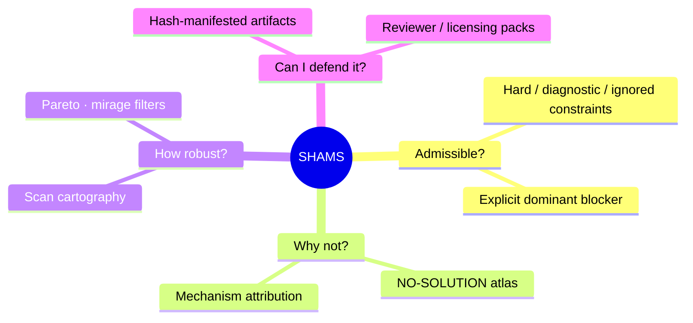
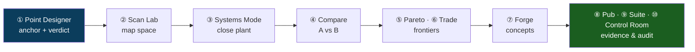
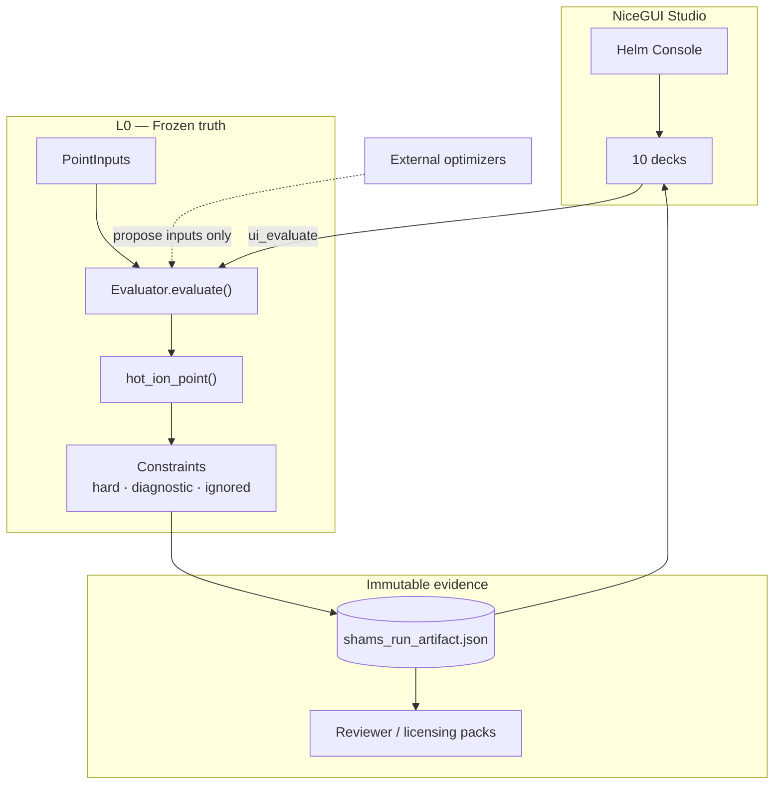
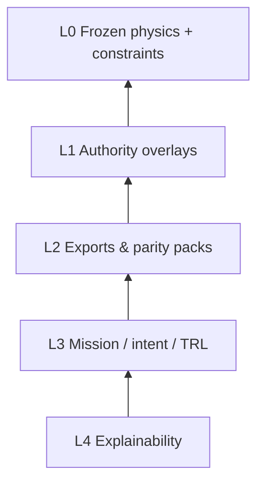
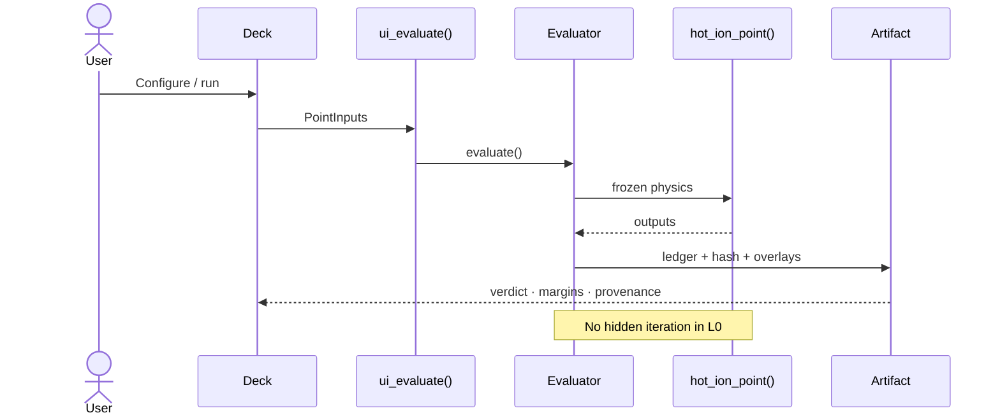
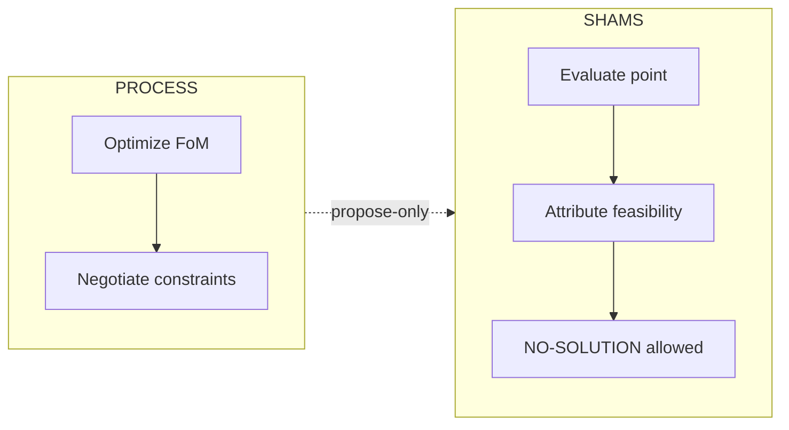

# SHAMS — Tokamak 0-D Design Studio

[](VERSION)
[](requirements.txt)
[](ui_nicegui/)
[](LICENSE)
[](GOVERNANCE.md)

**Feasibility-authoritative** tokamak design studio for fusion engineers, reviewers, and researchers.

> **Same inputs → same outputs.** NO-SOLUTION is valid science. Optimizers propose; SHAMS certifies.

---

## What SHAMS answers



| You need… | SHAMS gives you… |
|-----------|------------------|
| Know if a point can exist | **FEASIBLE / INFEASIBLE** with margins |
| Know *why* it fails | Dominant constraint + mechanism (not solver noise) |
| Map empty vs fragile space | Scan Lab · Pareto · NO-SOLUTION atlas |
| Replay for a review | Immutable run artifacts + hashed export packs |
| Use an optimizer safely | **Propose-only** firewall — physics never negotiated |

**SHAMS** = *Systematic Hot-ion Analysis for Magnetic confinement Systems*  
A **0-D / volume-averaged / steady-state** screening studio — not a time-domain transport code, and **not** an optimizer inside frozen truth.

---

## 60-second start

```bash
git clone https://github.com/afshin-arj/SHAMS-0D-Tokamak-Design-Studio.git
cd SHAMS-0D-Tokamak-Design-Studio
python -m venv .venv
# Windows: .venv\Scripts\activate
# Unix:    source .venv/bin/activate
pip install -r requirements.txt
pytest tests/test_smoke.py -q
```

| OS | Launch studio |
|----|----------------|
| Windows | `run_ui_nicegui.cmd` |
| Linux / macOS | `./run_ui_nicegui.sh` |
| Any | `python ui_nicegui/app.py` |

Then: **Point Designer → Evaluate →** read the verdict → continue with Scan / Systems → seal in **Control Room**.

---

## Study workflow (10 decks)

Use the **Helm Console** (left drawer) to follow the numbered expert path.



| # | Deck | One-line job |
|---|------|----------------|
| 1 | **Point Designer** | One operating point → feasibility verdict |
| 2 | **Scan Lab** | 2-D cartography of feasible / first-failure regions |
| 3 | **Systems Mode** | Monte Carlo precheck + Newton solve (*proposes* inputs) |
| 4 | **Compare** | Diff baseline vs scenario artifacts |
| 5 | **Pareto Lab** | Feasible-only frontiers; mirage filter |
| 6 | **Trade Study Studio** | Certified trade studies & robust lanes |
| 7 | **Reactor Design Forge** | Intent → machine families → dossiers |
| 8 | **Publication Benchmarks** | Constitutional atlas & reviewer packs |
| 9 | **System Suite** | Read-only L1 overlays on a Point Designer artifact |
| 10 | **Control Room** | Provenance, protocol, repro lock, export |

> **Systems Mode ≠ System Suite** — Mode *solves* (propose-only); Suite *reviews* overlays on frozen truth.

---

## Architecture at a glance

Every evaluation goes through **one choke point**. UI and external optimizers never rewrite L0 physics.



### Layer stack (read-down, write-new)



| Layer | Lives in | Role |
|-------|----------|------|
| **L0** | `src/evaluator/` · `src/physics/hot_ion.py` | Single-pass deterministic truth |
| **L1** | `analysis/` | Post-truth authority overlays |
| **L2** | `tools/` · campaigns | Export adapters, packs |
| **L3** | Helm design contract | Reactor / Research / Pilot / HFS intent |
| **L4** | Compare · Scan interpret · Chronicle | Narratives & forensics |

### Evaluation sequence



---

## SHAMS vs PROCESS (short)



| | **PROCESS** | **SHAMS** |
|---|-------------|-----------|
| Core question | What optimizes my objective? | What is physically admissible — and why not? |
| Infeasibility | Often avoided / obscured | **First-class result** |
| Iteration in truth | Central | **Forbidden in L0** |
| Optimizers | Coupled | **Firewalled (CCFS)** |

Migration & independence docs:  
[`PROCESS_TO_SHAMS_MIGRATION_GUIDE.md`](docs/PROCESS_TO_SHAMS_MIGRATION_GUIDE.md) · [`PROCESS_CROSSWALK.md`](docs/PROCESS_CROSSWALK.md) · [`CHAMPION_CASES.md`](docs/CHAMPION_CASES.md) · [`LIMITATIONS.md`](docs/LIMITATIONS.md)

Certified Optimizer (search-and-certify; never optimizer-in-truth):  
[`CERTIFIED_OPTIMIZER.md`](docs/CERTIFIED_OPTIMIZER.md) · [`CERTIFIED_OPTIMIZER_ROADMAP.md`](docs/CERTIFIED_OPTIMIZER_ROADMAP.md)

<details>
<summary><strong>Extended comparison tables</strong> (philosophy · numerics · constraints · governance)</summary>

### Purpose

| Dimension | SHAMS | PROCESS |
|-----------|-------|---------|
| Primary role | Feasibility authority & governance | Design optimization |
| Empty design space | Explicitly allowed | Implicitly discouraged |
| Scientific posture | Constraint-first, mechanism-explicit | Objective-first, solver-driven |

### Numerics

| Aspect | SHAMS | PROCESS |
|--------|-------|---------|
| Evaluator | Frozen deterministic algebraic | Coupled nonlinear solver |
| Same inputs → same outputs | Guaranteed | Solver-path dependent |

### Constraints & optimization

| Topic | SHAMS | PROCESS |
|-------|-------|---------|
| Classification | Hard / Diagnostic / Ignored | Often via penalties |
| Negotiation in truth | Not allowed | Common |
| Internal L0 optimization | Forbidden | Core feature |
| External optimization | Certified & firewalled | N/A |

### Governance

| Feature | SHAMS | PROCESS |
|---------|-------|---------|
| Audit trail | Hash-manifested evidence packs | Limited |
| Reviewer artifacts | One-click packs | Manual |

</details>

---

## Repository map

```text
SHAMS-0D/
├── ui_nicegui/          # NiceGUI studio (primary UI)
├── ui/                  # Legacy Streamlit (redirects to NiceGUI)
├── src/
│   ├── evaluator/       # L0 choke point
│   ├── physics/         # hot_ion_point (frozen)
│   ├── constraints/     # hard / diagnostic / ignored
│   └── …                # solvers, extopt, diagnostics (call L0)
├── analysis/            # Authority overlays (L1)
├── tests/ · tests/golden/
├── verification/
├── docs/
├── GOVERNANCE.md
└── VERSION
```

**Validate:** `pytest` · `python verification/run_verification.py`

---

## Scientific honesty

SHAMS screens with **engineering proxies** (e.g. divertor heat-flux, TBR, plant ledger). It does **not** claim:

- validated SOLPS divertor design margins,
- time-domain transport solutions,
- Monte Carlo neutronics inside L0,
- or automatic “best design” selection.

See [`docs/LIMITATIONS.md`](docs/LIMITATIONS.md). Physics changes require explicit versioning per [`GOVERNANCE.md`](GOVERNANCE.md).

---

## Cite & contribute

- Cite `CITATION.cff` + exact `VERSION` + SHA-256 hashes of exported artifacts  
- Zenodo metadata: `.zenodo.json` · archival checklist: [`docs/RELEASE_ARCHIVAL_CHECKLIST.md`](docs/RELEASE_ARCHIVAL_CHECKLIST.md)  
- Additive UI / docs welcome; L0 changes need governance + tests green  

---

## Contact

**Dr. Afshin Arjhangmehr** · ms.arjangmehr@gmail.com

---

## License

[Apache License 2.0](LICENSE)
