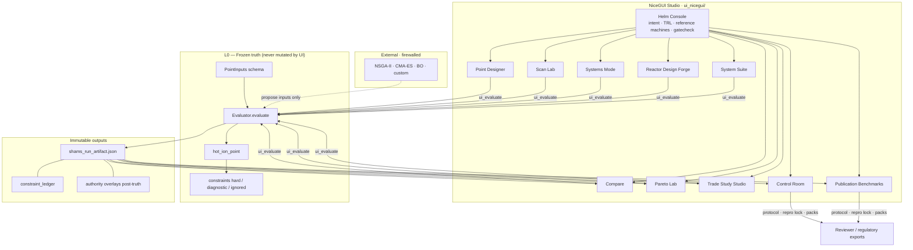
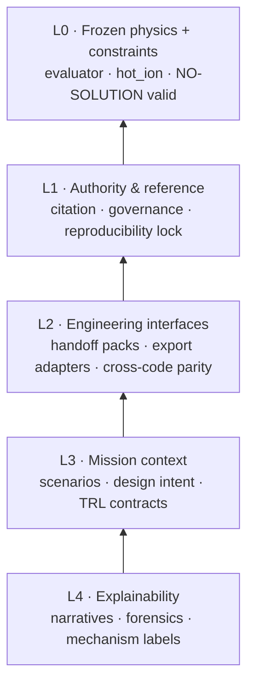
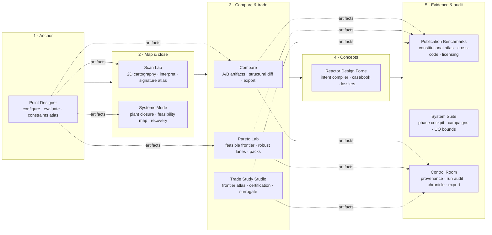
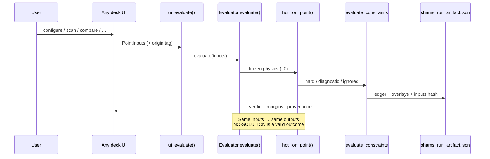
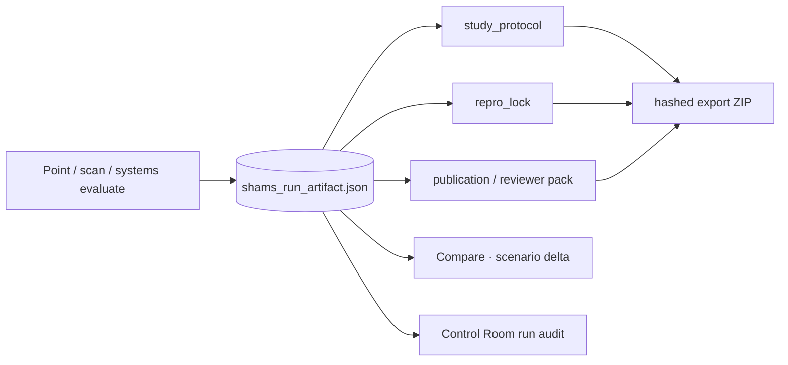

# SHAMS — Tokamak 0-D Design Studio

**Version:** v418.1.0  
**Posture:** Feasibility-authoritative · Frozen deterministic truth · NO-SOLUTION is valid science

---

## What SHAMS is

**SHAMS** (*Systematic Hot-ion Analysis for Magnetic confinement Systems*) is a **tokamak 0-D design studio and governance platform** for fusion engineers, program reviewers, and researchers who need to know:

- which designs are **physically admissible** under explicit constraints,
- **why** feasibility breaks (dominant mechanism, not solver noise),
- where design space is **robust, fragile, mirage, or empty**,
- and how **confident** a conclusion is given declared model authority.

SHAMS is deliberately **not** an optimizer inside physics truth. It is a **single-pass, deterministic evaluator** with explicit hard / diagnostic / ignored constraints, full artifact provenance, and reviewer-grade export paths.

> **Same inputs → same outputs.** No hidden iteration, smoothing, or penalty negotiation in frozen truth (L0).

---

## Why the community should care

| Question | Typical system codes | SHAMS |
|----------|---------------------|-------|
| What if the design is infeasible? | Often obscured by solver failure | **Reported, attributed, preserved** |
| Can I replay this for a review? | Ad hoc | **Hash-manifested artifacts & packs** |
| Does empty design space exist? | Discouraged implicitly | **Explicit NO-SOLUTION atlas** |
| Can an optimizer change physics? | Sometimes coupled | **Firewalled — optimizers propose inputs only** |

SHAMS complements codes like **PROCESS** where you need **feasibility authority** and auditability rather than negotiated convergence to an objective.

---

## Studio UI — NiceGUI (recommended)

The primary interface is the **NiceGUI design studio** — a verdict-first, deck-based workflow aligned with how fusion experts actually study a machine:

| Step | Deck | Purpose |
|------|------|---------|
| 1 | **Point Designer** | Anchor one operating point; read feasibility verdict |
| 2 | **Scan Lab** | Map feasible regions (cartography) |
| 3 | **Systems Mode** | Integrated plant / systems closure |
| 4 | **Compare** | Baseline vs scenario artifact diffs |
| 5 | **Pareto Lab** | Nondominated feasible frontiers |
| 6 | **Trade Study Studio** | Certified trade studies & robust lanes |
| 7 | **Reactor Design Forge** | Concept families, casebook, dossiers |
| 8 | **Publication Benchmarks** | Constitutional atlas, reviewer packs |
| 9 | **System Suite** | Batch campaigns |
| 10 | **Control Room** | Governance, provenance, export, audit |

**Launch (Windows):**
```cmd
run_ui_nicegui.cmd
```

**Launch (Linux / macOS):**
```bash
./run_ui_nicegui.sh
```

**Launch (Python):**
```bash
cd SHAMS-0D
pip install -r requirements.txt
python ui_nicegui/app.py
```

The legacy Streamlit shell (`run_ui.cmd`) remains for compatibility but **redirects fully ported decks** to NiceGUI.

---

## Quick start (first evaluation)

```bash
git clone https://github.com/afshin-arj/SHAMS-0D-Tokamak-Design-Studio.git
cd SHAMS-0D-Tokamak-Design-Studio
python -m venv .venv
# Windows: .venv\Scripts\activate
# Unix:    source .venv/bin/activate
pip install -r requirements.txt
pytest tests/test_smoke.py -q
run_ui_nicegui.cmd    # or ./run_ui_nicegui.sh
```

1. Open **Point Designer** → configure geometry & plasma → **Evaluate**.  
2. If feasible, explore **Scan Lab** or **Systems Mode**.  
3. Use **Compare** / **Pareto Lab** for design decisions.  
4. Seal the study in **Control Room** (protocol, repro lock, export).

---

## Architecture

SHAMS is organized as a **layered authority stack**: one frozen physics core (L0), read-only overlays and exports above it (L1–L4), and a **NiceGUI studio** that routes every evaluation through a single choke point. External optimizers and batch tools **propose inputs only** — SHAMS re-evaluates and records evidence.

### System overview



### Layer model

Higher layers **read** L0 artifacts and **write new** derived artifacts — they never rewrite physics results.



| Layer | Code anchor | What it does |
|-------|-------------|--------------|
| **L0** | `src/evaluator/core.py` → `src/physics/hot_ion.py` | Single-pass deterministic evaluation; constraint ledger; run artifacts |
| **L1** | `analysis/` authority overlays, `GOVERNANCE.md` | Confidence tiers, dominance, epoch feasibility, constitutional docs |
| **L2** | `src/campaign/`, `tools/` export builders | Benchmark packs, reviewer ZIPs, licensing bundles, case decks |
| **L3** | Helm Console design contract, mission profiles | Reactor / research / pilot / HFS intent; enforcement tiering |
| **L4** | Chronicle instruments, Compare diffs, Scan interpret | Sensitivity, feasibility maps, scenario delta, local forensics |

### Expert workflow — all ten decks

Decks follow the **numbered sidebar workflow** (Helm Console → Navigation). Each deck is verdict-first; none iterates inside L0 truth.



### Deck feature map

| Deck | Primary tabs / sections | Key capabilities |
|------|-------------------------|------------------|
| **Point Designer** | Configure · Telemetry · Constraints · Mission | Single-point evaluate; NO-SOLUTION atlas; constraint diff dossier; overlay dashboard |
| **Scan Lab** | Setup · Cartography · Interpret · Artifact restore | 2D feasible-region maps; first-failure topology; scan atlas capsules |
| **Systems Mode** | Workflow tabs + plant authority | Integrated systems solve; power-balance diagram; feasibility heatmap; reproduce/diff |
| **Compare** | Load · Performance · Constraints · Inputs & Structure · Export | Metric/input/structural diffs; scenario delta; comparison bundles |
| **Pareto Lab** | Explore · Interpret · Audit · Publication · External | Nondominated feasible frontier; mirage filtering; optimistic vs robust lanes |
| **Trade Study Studio** | Setup · Frontier · Robust · Surrogate · Optimizer kits | Certified trade studies; interval narrowing; external optimizer handoff |
| **Reactor Design Forge** | Intent · Explore · Casebook · Archive · Dossier | 67 expert instruments; staged runs; collaboration sessions |
| **Publication Benchmarks** | Atlas · Pack · Cross-Code · Governance · Evidence | Constitutional preset atlas; reviewer/regulatory/licensing ZIPs |
| **System Suite** | Workflow + phase cockpit | Batch campaigns; mode contracts; parity suite; absolute UQ bounds |
| **Control Room** | Orient · Constitution · Provenance · Artifacts · Diagnostics · Chronicle | Run audit overlays; case deck runner; scenario delta; constraint cockpit; repro lock |

**Helm Console** (always visible in the left drawer): session posture, design contract (intent + TRL + q95/Greenwald enforcement), reference machine presets, fidelity declarations, calibration multipliers, integrity gatecheck, activity chronicle, and deck navigation.

### Evaluation choke point

Every UI path that needs physics calls **`ui_evaluate()`** → **`Evaluator.evaluate()`** → **`hot_ion_point()`**. No deck bypasses this chain.



### Artifact & governance flow

Artifacts are **immutable** once written. Downstream decks consume them read-only; exports append new hashed bundles.



### Repository map

| Area | Path |
|------|------|
| Frozen evaluator | `src/evaluator/` · `src/physics/hot_ion.py` |
| Constraints | `src/constraints/` · `authority_caps.json` |
| Authority overlays | `analysis/` |
| NiceGUI studio | `ui_nicegui/` (`app.py`, `decks/`, `session.py`) |
| Legacy UI (redirects) | `ui/app.py` |
| Tests & golden baselines | `tests/` · `tests/golden/` |
| Verification gate | `verification/run_verification.py` |
| Governance | `GOVERNANCE.md` · `VERSION` |

**Validation:** `pytest` · `python verification/run_verification.py`

---

## Scientific scope (honest limits)

SHAMS is a **0-D / volume-averaged / steady-state** screening studio with explicit engineering proxies (magnets, exhaust, neutronics tiers, plant ledger). It does **not** implement:

- time-domain transport solvers,
- Monte Carlo inside truth,
- internal optimization or Newton negotiation in L0.

Those belong **outside** the evaluator, with SHAMS re-evaluating every proposed input set.

---

## Latest release notes (v418.x)

- **NiceGUI studio complete** — all primary decks ported with expert workflow navigation, guided modes, and Streamlit redirects.
- Registry code-generation from `authority_caps.json`; NO-SOLUTION mechanism atlas; constraint diff dossier in Point Designer.
- H-mode scalings, ELM duty-cycle availability, tritium reactor preset; overlay dashboard refresh.

Details: `docs/patch_notes/PATCH_NOTES_v418.md`

---

## SHAMS vs PROCESS (one paragraph)

**PROCESS** asks: *what design optimizes my objective if constraints can be negotiated?*  
**SHAMS** asks: *which tokamak designs are admissible, how robust are they, why do others fail, and what evidence supports the claim?*

For the full comparison table, see the [extended comparison section](#extended-comparison-shams-vs-process) below.

---

## Contributing & governance

- Physics / constraint changes: explicit request + versioning (`GOVERNANCE.md`)
- Additive UI, schemas, docs: welcome without altering L0 behavior
- Run `pytest` and `python verification/run_verification.py` before PRs

---

## Contact

**Dr. Afshin Arjhangmehr**  
📧 ms.arjangmehr@gmail.com

---

## Extended comparison: SHAMS vs PROCESS

### 1. Purpose & Philosophy

| Dimension | SHAMS | PROCESS |
|---------|-------|---------|
| Primary role | **Feasibility authority & governance system** | Design optimization system |
| Core question | *What machines can physically exist, and why others cannot?* | *What machine optimizes a chosen objective?* |
| Treatment of failure | **First-class scientific result** | Avoided if possible |
| Empty design space | **Explicitly allowed** | Implicitly discouraged |
| Scientific posture | Constraint-first, mechanism-explicit | Objective-first, solver-driven |
| Intended use | Review, feasibility authority, governance | Parametric design optimization |

### 2. Numerical & Algorithmic Discipline

| Aspect | SHAMS | PROCESS |
|------|-------|---------|
| Evaluator type | **Frozen deterministic algebraic evaluator** | Coupled nonlinear solver system |
| Iteration | **Forbidden in L0 truth** | Central |
| Determinism | **Bitwise reproducible** | Solver-path dependent |
| Same inputs → same outputs | **Guaranteed** | Not guaranteed |

### 3. Constraint Handling

| Topic | SHAMS | PROCESS |
|------|-------|---------|
| Constraint classification | **Hard / Diagnostic / Ignored (explicit)** | Implicit via penalties |
| Constraint negotiation | **Not allowed in truth** | Common |
| Dominant failure mechanism | **Explicitly identified** | Often obscured |

### 4. Optimization (critical distinction)

| Aspect | SHAMS | PROCESS |
|------|-------|---------|
| Internal optimization | **Forbidden in L0** | Core feature |
| External optimization | **Yes (certified & firewalled)** | N/A |
| Feasibility enforcement | **Absolute** | Negotiable |

### 5. Governance & Review

| Feature | SHAMS | PROCESS |
|------|-------|---------|
| Audit trail | **Hash-manifested evidence packs** | None |
| Replayability | **Guaranteed** | Not guaranteed |
| Reviewer artifacts | **One-click reviewer packs** | Manual |

---

## License

See repository license file. Cite SHAMS version and artifact hashes when publishing results derived from this studio.
